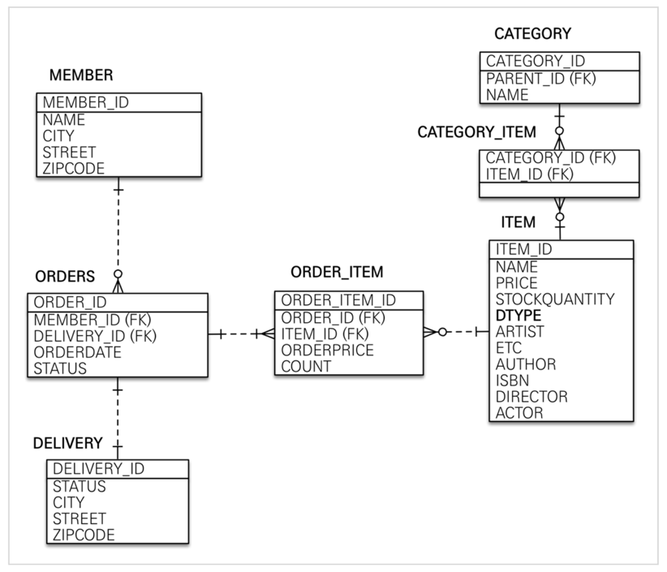

# SpringJPA_1
인프런 영한님의 실전 스프링부트 + JPA활용편의 프로젝트입니다.

### Dependencies
- Spring Web
- Thymeleaf
- Spring Data JPA
- H2 Database
- Lombok

---
## 도메인 분석 설계

회원
- 가입 신청
- 목록 조회

상품
- 등록
- 수정
- 조회

주문
- 상품 주문
- 주문 내역 조회
- 주문 취소

기타 요구 사항
- 상품의 재고관리가 필요
- 상품의 종류는 3종류 ( 도서 , 음반 , 영화)
- 상품을 카테고리로 구분할 수 있다
- 상품 주문시 배송 정보를 입력할 수 있다.

----
## 테이블 설계

- 회원과 주문
  - 회원은 여러 상품을 주문 할 수 있다
  - 일 대 다 ( 1 : * )
  - 일대다 , 다대일 양뱡향 관계는 연관관계의 주인을 정해야 한다.
  - 외래키가 있는 주문을 주인으로 정하는 것이 좋다.

- 주문과 상품
  - 주문 할 때 여러개의 상품을 주문할 수 있다
  - 일 대 다 ( 1 : *)
  -  
- 상품과 카테고리 
  - 하나의 카테고리에 여러 상품을 혹은 그 반대가 가능하다
  - 다 대 다 ( * : *)

- 다대다 관계는 쓰면 안된다.
- 양뱡향 연관관계도 가급적 권고되지 않는다.
- 싱글 테이블 전략

